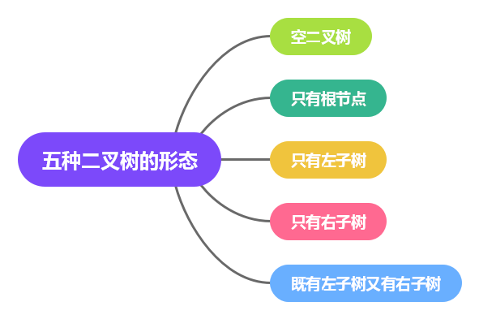
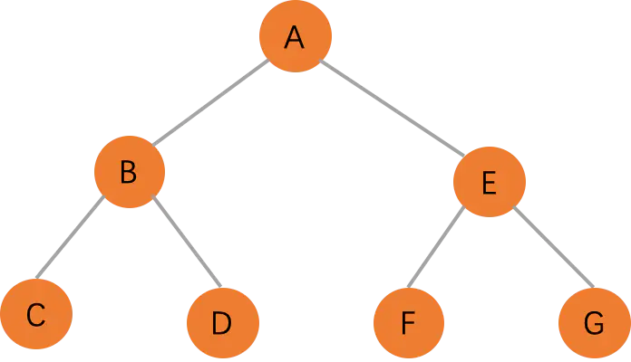
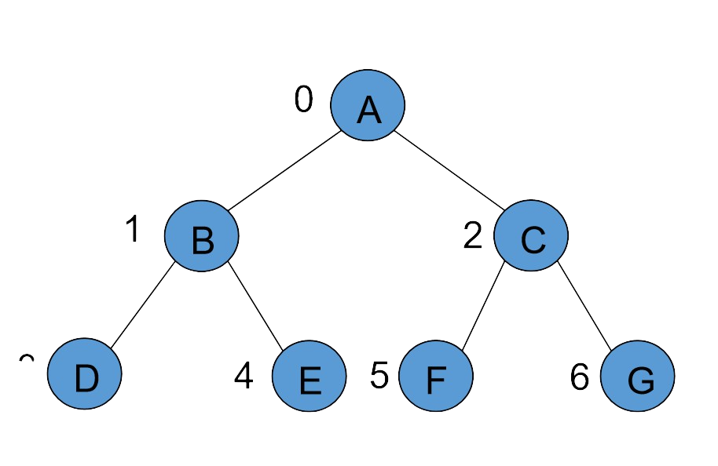
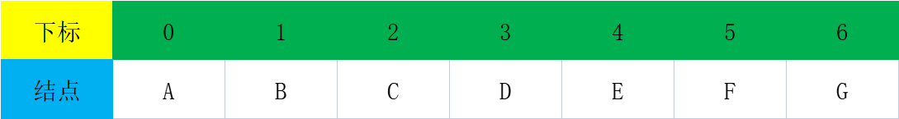
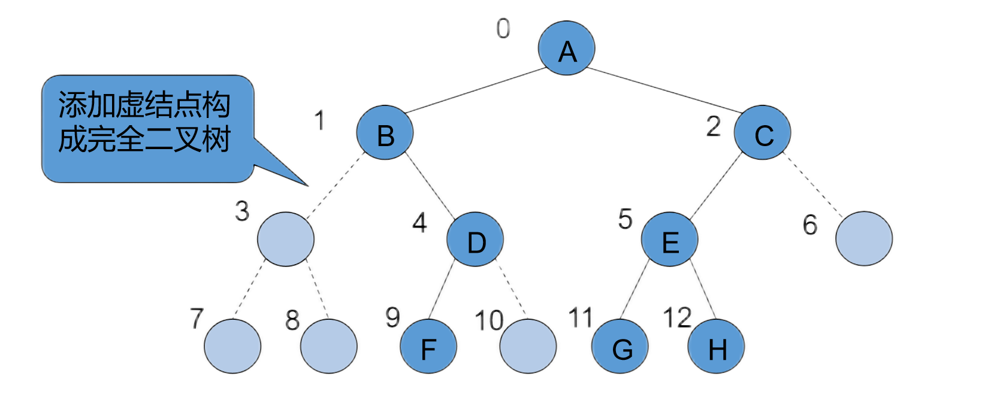
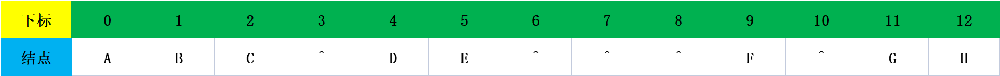
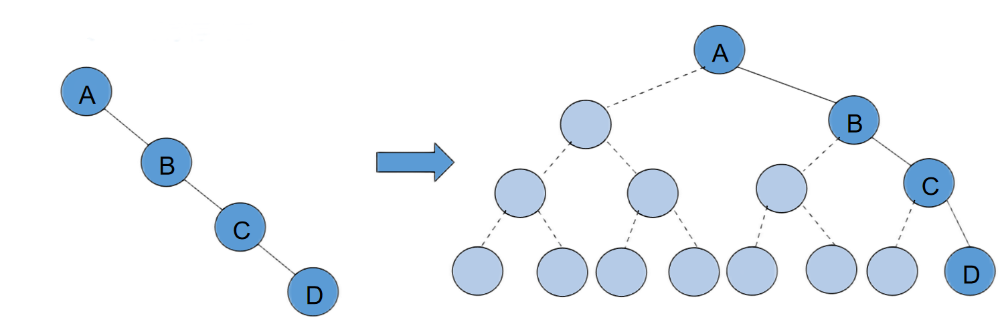

# 二叉树

### 什么是二叉树
在计算机科学中，二叉树（英语：Binary tree）是每个节点最多只有两个分支（即不存在分支度大于2的节点）的树结构。通常分支被称作“左子树”或“右子树”。二叉树的分支具有左右次序，不能随意颠倒。

### 左子树和右子树
* 左子树: 左子树是以当前结点的左孩子结点作为根节点的子树
* 右子树: 以左孩子结点作为根节点的子树

### 二叉树的五种状态

### 二叉树的作用
* 存放数据
* 提高查找效率
* 实现简单而相当有效的数据压缩算法
* 大型数据库等软件实现快速搜索功能

### 满二叉树

满二叉树是最后一层是叶子结点，其余结点度是2的二叉树

性质: 
* 同样深度的二叉树中满二叉树结点数量最多
* 第`i`层的结点数量为: 2i - 1
* 深度为`k`的满二叉树，结点数量为: 2k-1，叶子数为2k-1
* 满二叉树中不存在度为 1 的节点，每一个分支点中都两棵深度相同的子树，且叶子节点都在最底层
* 具有 n 个节点的满二叉树的深度为 log2(n+1)

### 完全二叉树
完全二叉树是在一棵满二叉树基础上自左向右连续增加叶子结点得到的二叉树

性质:
* 叶子结点只能出现在最后两层
* 最后一层的叶子结点集中在左边连续的位置
* 除最后一层是一棵满二叉树

注意: 满二叉树一定是完全二叉树，但是完全二叉树不一定是满二叉树

### 二叉树的性质

* 性质1: 在非空二叉树的第i层上，至多有2i-1个结点(`i>=1`)
* 性质2: 在深度为K的二叉树上最多有2k-1个结点（k>=1)
* 性质3: 在任意一棵二叉树中，叶子结点的数目比度数为2的结点的数目多1,即 `n0 =  n2 + 1`
* 性质4: 具有n个结点的完全二叉树的深度为 log2n + 1，结果需要向下取整
* 性质5: 完全二叉树结点的编号方法是从上到下，从左到右，根节点为1号结点，设完全二叉树的结点数为n，某结点编号为 i
    - 若 i=1，则该结点是二叉树的根
    - 若 2*i>n，则该结点无左孩子，否则，其左孩子结点是编号为 2*i 的结点
    - 若 2*i+1>n，则该结点无右孩子结点，否则，其右孩子结点是编号为2*i+1 的结点

### 二叉树的顺序存储结构

#### 完全二叉树(满二叉树)的顺序存储结构
使用数组依次从上到下、自左向右存储所有的结点元素

示例完全二叉树

我们还可以根据满二叉树的顺序存储结构恢复二叉树

#### 存储非完全二叉树

* 添加虚构结点构造完全二叉树

* 由上往下，由左往右存放，虚设结点表示为空

#### 顺序存储存在的问题

* 浪费存储空间，存储密度低

对应的数组示意图

