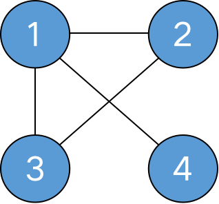
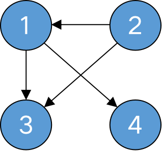
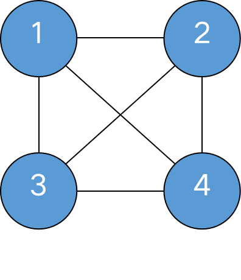
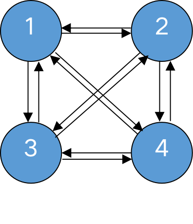
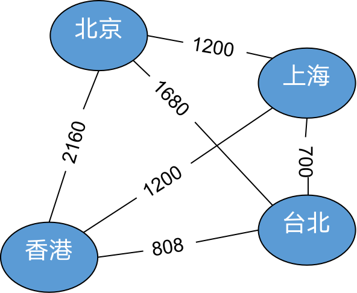

# 图的简介

## [什么是图](https://zh.wikipedia.org/wiki/%E5%9B%BE_(%E6%95%B0%E6%8D%AE%E7%BB%93%E6%9E%84))
> 在计算机科学中，图（英语：graph）是一种抽象数据类型，用于实现数学中图论的无向图和有向图的概念。  
图的数据结构包含一个有限（可能是可变的）的集合作为节点集合，以及一个无序对（对应无向图）或有序对（对应有向图）的集合作为边（有向图中也称作弧）的集合。节点可以是图结构的一部分，也可以是用整数下标或引用表示的外部实体。  
图的数据结构还可能包含和每条边相关联的数值（edge value），例如一个标号或一个数值（即权重，weight；表示花费、容量、长度等）。

## 相关概念
* 顶点: 图中的数据元素，如 `V0 V1 V2 V3 V4`
* 边: 顶点之间的边，如顶点`V0`和顶点`V1 V3`存在边，和 `V2 V4` 不存在边
* 无向边: 没有方向的边
* 有向图边: 有方向的边
* 入边: 箭头指向当前顶点的有向边
* 出边: 从当前顶点出发的边
* 领接点: 与当前顶点之间存在无向边的顶点

## 无向图
* 所有边均为无向边的图

## 有向图
* 所有边均为有向边的图

## 无向完全图
* 任意两个顶点之间都存在边的无向图
* 边的数量: `e = n * (n - 1) / 2`

## 有向完全图
* 任意两个顶点之间都存在方向相反的两条有向边的有向图
* 边的数量: `e = n * (n - 1)`

## 网
* 带权的图

## 顶点的度，入度，出度

