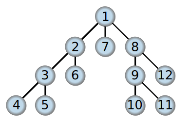

# 图的遍历

### [什么是图的遍历](https://en.wikipedia.org/wiki/Graph_traversal)
 > 在计算机科学中，图遍历（也称为图搜索）是指访问（检查/或更新）图中每个顶点的过程。这种遍历按照访问顶点的顺序进行分类。树遍历是图遍历的一个特例。

 ### 图的遍历问题分类
* 遍历完所有的边而不能有重复，即所谓“欧拉路径问题”（又名一笔画问题）
* 遍历完所有的顶点而没有重复，即所谓“哈密顿路径问题”
* 遍历完所有的边而可以有重复，即所谓“中国邮递员问题”
* 遍历完所有的顶点而可以重复，即所谓“旅行推销员问题”

### 遍历方法
* 深度优先搜索法
* 广度（宽度）优先搜索算法

### [深度优先搜索算法](https://zh.wikipedia.org/wiki/%E6%B7%B1%E5%BA%A6%E4%BC%98%E5%85%88%E6%90%9C%E7%B4%A2)

> 深度优先搜索算法（英语：Depth-First-Search，DFS）是一种用于遍历或搜索树或图的算法。这个算法会尽可能深的搜索树或图的分支。当节点v的所在边上的节点都己被探寻过，搜索将回溯到发现节点v的那条边的起始节点。这一过程一直进行到已发现从源节点可达的所有节点为止。如果还存在未被发现的节点，则选择其中一个作为源节点并重复以上过程，整个进程反复进行直到所有节点都被访问为止。这种算法不会根据图的结构等信息调整执行策略[来源请求]。

注意: 树或图的深度优先搜索结果不唯一

### 深度优先搜索

* 深度优先搜索: `1 -> 2 -> 3 -> 4 -> 5 -> 6 -> 7 -> 8 -> 9 -> 10 -> 11 -> 12`

