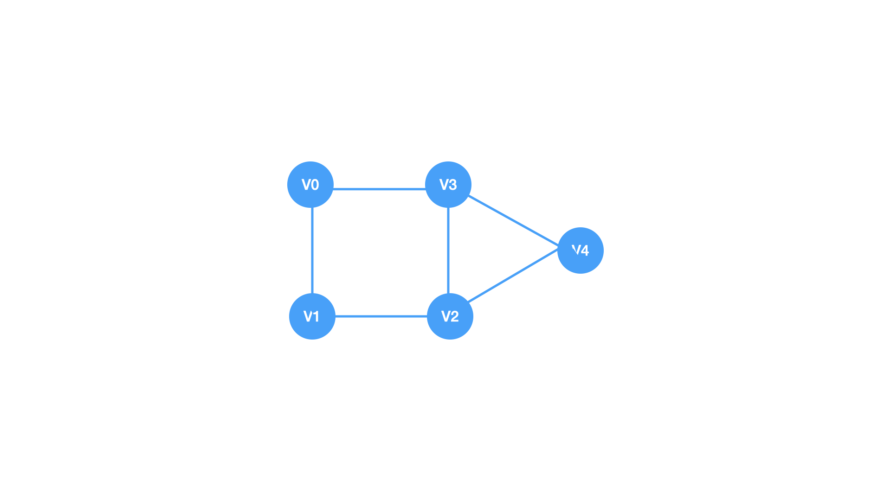
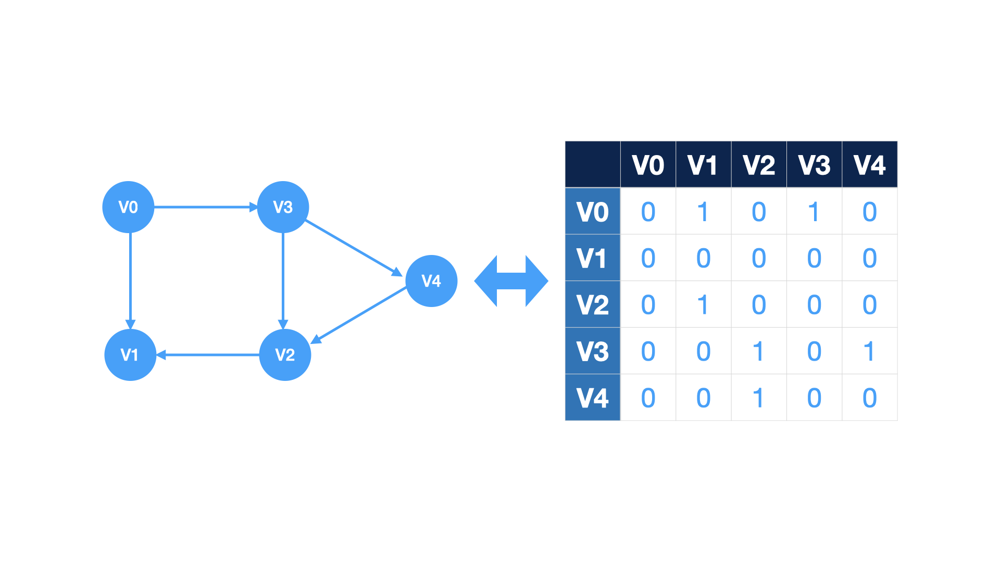

# 图的邻接矩阵表示法


### [什么是邻接矩阵](https://zh.wikipedia.org/wiki/%E9%82%BB%E6%8E%A5%E7%9F%A9%E9%98%B5)
在图论和计算机科学中，邻接矩阵（英语：adjacency matrix）是一种方阵，用来表示有限图。它的每个元素代表各点之间是否有边相连。

作为特例，简单图的邻接矩阵是(0,1)矩阵并且对角线元素都为0。无向图的邻接矩阵是对称矩阵。图和其邻接矩阵的特征值和特征向量之间的关系是谱图理论的研究对象。


### 采用邻接矩阵表示无向图
特点
* 对角线元素均为0
* 左下三角形和右上三角形对称

我们可以采用一位数组保存图中的顶点信息，采用二维数组表示图中顶点和顶点的关系，如果存在边则二维数组对应的元素为1，否则为0


### 采用邻接矩阵表示有向图
特点
* 对角线元素为0
* 不一定对称



### 邻接矩阵表示图案例

<details>
<summary>源代码</summary>

``` c
#include <assert.h>
#include <stdbool.h>

#define VERTEX_NUM 5 //顶点的数量
typedef char ElemType;
typedef struct {
    ElemType vertex[VERTEX_NUM]; //存储顶点的一维数组
    int edge[VERTEX_NUM][VERTEX_NUM]; //存储顶点之间关系的邻接矩阵
} Graph;

void test() {
    Graph graph;
    /* init vertexes */
    for (int i = 0; i < VERTEX_NUM; ++i) {
        graph.vertex[i] = 'A' + i;
    }

    int matrix[VERTEX_NUM][VERTEX_NUM] = {
            {0, 1, 0, 1, 0},
            {1, 0, 1, 1, 0},
            {0, 1, 0, 0, 1},
            {1, 1, 0, 0, 1},
            {0, 0, 1, 1, 0}
    };
}

int main() {
    test();
    return 0;
}
```
</details>

### 邻接矩阵表示法的特点
* 无法表示顶点数量极大的图
* 当表示稀疏图的时候，浪费存储空间