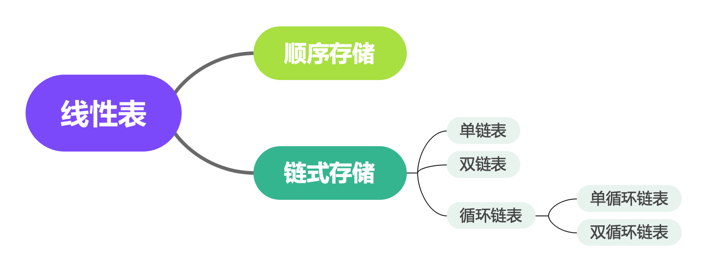

# 线性表

### 什么是线性表
线性表（英语：Linear List）是由n（n≥0）个数据元素（结点）a[0]，a[1]，a[2]…，a[n-1]组成的有限序列。

一个数据元素可以由若干个数据项组成。数据元素称为记录，含有大量记录的线性表又称为文件。这种结构具有下列特点：存在一个唯一的没有前驱的（头）数据元素；存在一个唯一的没有后继的（尾）数据元素；此外，每一个数据元素均有一个直接前驱和一个直接后继数据元素。 

