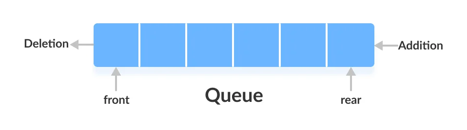

# 队列


### 什么是队列
队列，又称为伫列（queue），计算机科学中的一种抽象数据类型，是先进先出（FIFO, First-In-First-Out）的线性表。在具体应用中通常用链表或者数组来实现。队列只允许在后端（称为rear）进行插入操作，在前端（称为front）进行删除操作。

队列的操作方式和堆栈类似，唯一的区别在于队列只允许新数据在后端进行添加。


### 队列的分类
* 顺序存储
    * 普通顺序队列
    * 循环队列
* 链式存储


### 普通顺序队列
使用一段连续的存储空间存储数据元素，使用过的空间不能重复使用，比较浪费空间。入队（插入) 只能从队尾(`rear`)指针入队，出队（删除）只能从队头指针(`front`) 删除。



#### 结构体类型的定义
``` c
typedef int ElemType;
typedef struct Queue {
    ElemType *base;
    int front; /* front pointer of queue */
    int rear; /* rear pointer of queue */
} Queue;
```

#### 初始化队列
``` c
void initQueue(Queue *pQueue) {
    pQueue->base = malloc(sizeof(struct Queue) * MAX_SIZE);
    pQueue->front = pQueue->rear = 0;
}
```

#### 判断队列是否为空
``` c
bool isEmpty(Queue *pQueue) {
    return pQueue->rear == pQueue->front;
}
```

#### 判断队列是否满
```
bool isFull(Queue *pQueue) {
    return pQueue->rear == MAX_SIZE;
}
```

#### 求队列的大小
``` c
int size(Queue *pQueue) {
    return pQueue->rear - pQueue->front;
}
```

#### 入队操作
``` c
bool enqueue(Queue *pQueue, ElemType e) {
    if (isFull(pQueue)) {
        perror("can't enqueue to full queue");
        return false;
    }
    pQueue->base[pQueue->rear] = e;
    pQueue->rear++;
    return true;
}
```

#### 出队操作
``` c
ElemType dequeue(Queue *pQueue) {
    if (isEmpty(pQueue)) {
        perror("can't dequeue from empty queue.");
    }
    return pQueue->base[pQueue->front++];
}
```

#### 获取对头元素
```c
ElemType getFront(Queue *pQueue) {
    if (isEmpty(pQueue)) {
        perror("can't get front from empty queue.");
    }
    return pQueue->base[pQueue->front];
} 
```

#### 获取队尾元素
``` c
ElemType getRear(Queue *pQueue) {
    if (isEmpty(pQueue)) {
        perror("can't get rear from empty queue.");
    }
    return pQueue->base[pQueue->rear - 1];
}
```

#### 遍历队列所有元素
``` c
void printQueue(Queue *pQueue) {
    for (int i = pQueue->front; i < pQueue->rear; ++i) {
        printf("%d\t", pQueue->base[i]);
    }
    printf("\n");
}
```

#### 清空队列
``` c
void clear(Queue *pQueue) {
    pQueue->front = pQueue->rear = 0;
}
```

### 循环队列
普通顺序队列存在假益处问题，为了解决这个问题引入循环顺序队列。


#### 如何判断队列是否满
* 方法一: 额外定义一个成员变量，记录队列的元素个数，如果长度 `size == MAX` 则表示循环队列满了
* 方法二: 给队列额外留出出一个空间，当队列中只剩下一个空间时，表示队列已经满了

我们这儿采用第二种方式来表示
#### 循环队列结构体定义
``` c
typedef int ElemType;
typedef struct Queue {
    ElemType *base;
    int front; /* front pointer of queue */
    int rear; /* rear pointer of queue */
} Queue;
```

#### 初始化队列
``` c
void initQueue(Queue *pQueue) {
    pQueue->base = malloc(sizeof(ElemType) * MAX_SIZE);
    pQueue->front = pQueue->rear = 0;
}
```

#### 判断队列是否为空
``` c
bool isEmpty(Queue *pQueue) {
    return pQueue->front == pQueue->rear;
}
```

#### 判断队列是否满
``` c
bool isFull(Queue *pQueue) {
    return (pQueue->rear + 1) % MAX_SIZE == pQueue->front;
}
```

#### 求队列的长度
``` c
int length(Queue *pQueue) {
    return (pQueue->rear - pQueue->front + MAX_SIZE) % MAX_SIZE;
}
```

#### 入队
``` c
bool enqueue(Queue *pQueue, ElemType elem) {
    if (isFull(pQueue)) {
        perror("can't enqueue to full queue");
        return false;
    }
    pQueue->base[pQueue->rear] = elem;
    pQueue->rear = (pQueue->rear + 1) % MAX_SIZE;
    return true;
}
```

#### 出队
``` c
ElemType dequeue(Queue *pQueue) {
    if (isEmpty(pQueue)) {
        perror("can't dequeue from empty queue.");
    }
    ElemType elem = pQueue->base[pQueue->front];
    pQueue->front = (pQueue->front + 1) % MAX_SIZE;
    return elem;
}
```

#### 打印队列
``` c
void printQueue(Queue *pQueue) {
    for (int i = pQueue->front; i != pQueue->rear; i = (i + 1) % MAX_SIZE) {
        printf("%d\t", pQueue->base[i]);
    }
    printf("\n");
}
```

#### 清空队列
``` c
void clear(Queue *pQueue) {
    pQueue->rear = pQueue->front = 0;
}
```

#### 释放队列
``` c
void destroy(Queue *pQueue) {
    pQueue->rear = pQueue->front = 0;
    free(pQueue->base);
}
```

### 链式队列
采用链表实现的队列称之为链式队列，不需要实现分配队列的大小，而是入队动态增加内存空间。

#### 链式队列结构体的定义

``` c
typedef int ElemType;

typedef struct Node {
    ElemType data;
    struct Node *next;
} Node;

typedef struct {
    Node *front; /* front pointer of LinkedQueue */
    Node *rear; /* rear pointer of LinkedQueue */
    int size; /* the number count of LinkedQueue */
} LinkedQueue;
```

#### 初始化队列
``` c
void initQueue(LinkedQueue *queue) {
    queue->front = queue->rear = NULL;
    queue->size = 0;
}
```

#### 判断队列是否为空
``` c
bool isEmpty(LinkedQueue *queue) {
    return queue->size == 0;
}
```

#### 求队列长度
```
int size(LinkedQueue *queue) {
    return queue->size;
}
```

#### 入队
``` c
bool enQueue(LinkedQueue *queue, ElemType data) {
    struct Node *newNode = (struct Node*) malloc(sizeof(struct Node));
    newNode->data = data;
    if (isEmpty(queue)) {
        queue->front = queue->rear = newNode;
    } else {
        queue->rear = queue->rear->next = newNode;
    }
    queue->size++;
    return true;
}
```

#### 出队
``` c
ElemType deQueue(LinkedQueue *queue) {
    if (isEmpty(queue)) {
        perror("can't dequeue from empty queue.");
    }
    ElemType retValue = queue->front->data;
    if ((queue->front = queue->front->next) == NULL) {
        queue->rear = NULL;
    }
    queue->size--;
    return retValue;
}
```

#### 清空队列元素
``` c
void clearQueue(LinkedQueue *queue) {
    if (!isEmpty(queue)) {
        struct Node *cur = queue->front;
        struct Node *next = cur->next;
        while (next != NULL) {
            free(cur);
            cur = next;
            next = next->next;
        }
        free(cur);
    }
    queue->front = queue->rear = NULL;
    queue->size = 0;
}
```

#### 遍历队列元素
``` c
void printQueue(LinkedQueue *queue) {
    struct Node *temp = queue->front;
    while (temp != NULL) {
        printf("%d\t", temp->data);
        temp = temp->next;
    }
    printf("\n");
}
```

### 完整代码

C 
* [普通顺序队列](https://github.com/examplehub/C/blob/master/datastructures/queue/queue.c)
* [循环顺序队列](https://github.com/examplehub/C/blob/master/datastructures/queue/circle_queue.c)
* [链式队列](https://github.com/examplehub/C/blob/master/datastructures/queue/linked_queue.c)

Java
* [循环队列](https://github.com/examplehub/Java/blob/master/src/main/java/com/examplehub/datastructures/queue/Queue.java)
* [链式队列](https://github.com/examplehub/Java/blob/master/src/main/java/com/examplehub/datastructures/queue/LinkedQueue.java)