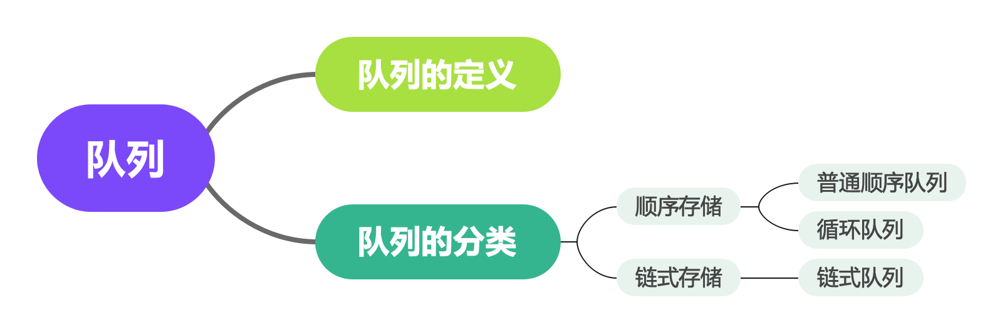

# 队列

### 什么是队列
队列，又称为伫列（queue），计算机科学中的一种抽象数据类型，是先进先出（FIFO, First-In-First-Out）的线性表。在具体应用中通常用链表或者数组来实现。队列只允许在后端（称为rear）进行插入操作，在前端（称为front）进行删除操作。

队列的操作方式和堆栈类似，唯一的区别在于队列只允许新数据在后端进行添加。


### 队列的分类
* 顺序存储
    * 普通顺序队列
    * 循环队列
* 链式存储



### 普通顺序队列
使用一段连续的存储空间存储数据元素，使用过的空间不能重复使用，比较浪费空间。

#### 结构体类型的定义
``` c
typedef int ElemType;
typedef struct Queue {
    ElemType *base;
    int front; /* front pointer of queue */
    int rear; /* rear pointer of queue */
} Queue;
```

#### 初始化队列
``` c
void initQueue(Queue *pQueue) {
    pQueue->base = malloc(sizeof(struct Queue) * MAX_SIZE);
    pQueue->front = pQueue->rear = 0;
}
```

#### 判断队列是否为空
``` c
bool isEmpty(Queue *pQueue) {
    return pQueue->rear == pQueue->front;
}
```

#### 判断队列是否满
```
bool isFull(Queue *pQueue) {
    return pQueue->rear == MAX_SIZE;
}
```

#### 求队列的大小
``` c
int size(Queue *pQueue) {
    return pQueue->rear - pQueue->front;
}
```

#### 入队操作
``` c
bool enqueue(Queue *pQueue, ElemType e) {
    if (isFull(pQueue)) {
        perror("can't enqueue to full queue");
        return false;
    }
    pQueue->base[pQueue->rear] = e;
    pQueue->rear++;
    return true;
}
```

#### 出队操作
``` c
ElemType dequeue(Queue *pQueue) {
    if (isEmpty(pQueue)) {
        perror("can't dequeue from empty queue.");
    }
    return pQueue->base[pQueue->front++];
}
```

#### 获取对头元素
```c
ElemType getFront(Queue *pQueue) {
    if (isEmpty(pQueue)) {
        perror("can't get front from empty queue.");
    }
    return pQueue->base[pQueue->front];
} 
```

#### 获取队尾元素
``` c
ElemType getRear(Queue *pQueue) {
    if (isEmpty(pQueue)) {
        perror("can't get rear from empty queue.");
    }
    return pQueue->base[pQueue->rear - 1];
}
```

#### 遍历队列所有元素
``` c
void printQueue(Queue *pQueue) {
    for (int i = pQueue->front; i < pQueue->rear; ++i) {
        printf("%d\t", pQueue->base[i]);
    }
    printf("\n");
}
```

#### 清空队列
``` c
void clear(Queue *pQueue) {
    pQueue->front = pQueue->rear = 0;
}
```
