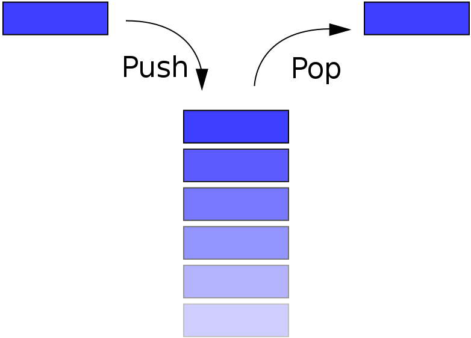
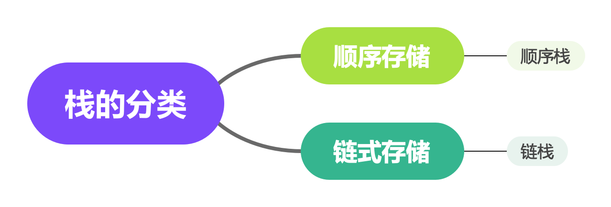

# 栈

### 什么是栈
堆栈（英语：stack）又称为栈或堆叠，是计算机科学中的一种抽象数据类型，只允许在有序的线性集合的一端（称为堆栈顶端，英语：top）进行加入数据（英语：push）和移除数据（英语：pop）的运算。因而按照后进先出（LIFO, Last In First Out）的原理运作。



### 栈的分类


#### 顺序栈
使用一段连续的存储空间(数组)保存数据元素，下标 `0` 位置表示栈底，`top` 表示栈顶指针。

##### 结构体定义
``` c
typedef int ElemType;
typedef struct Stack {
    ElemType *base;
    int top;
} Stack;
```
##### 初始化栈
``` c
void initStack(Stack *pStack) {
    pStack->base = malloc(MAX_SIZE * sizeof(ElemType));
    pStack->top = -1;
}
```
##### 判断栈是否为空
``` c
bool isEmpty(Stack *pStack) {
    return pStack->top == -1;
}
```
##### 判读栈是否满
``` c
bool isFull(Stack *pStack){
    return pStack->top + 1 == MAX_SIZE;
}
```

##### 求栈的大小
``` c
int length(Stack *pStack) {
    return pStack->top + 1;
}
```

##### 清空顺序栈
``` c
void clear(Stack *pStack) {
    pStack->top = -1;
}
```

##### 释放栈内存
``` c
void destroy(Stack *pStack) {
    free(pStack->base);
    pStack->top = -1;
}
```

##### 出栈
``` c
ElemType pop(Stack *pStack){
    if (isEmpty(pStack)){
        perror("pop from empty stack.");
    }
    return pStack->base[pStack->top--];
}
```

##### 入栈
``` c
bool push(Stack *pStack, ElemType elem){
    if (isFull(pStack)){
        perror("can't push full stack.");
        return false;
    }
    pStack->base[++pStack->top] = elem;
    return true;
}
```

##### 获取栈顶部元素
``` c
ElemType peek(Stack *pStack) {
    if (isEmpty(pStack)) {
        perror("can't peek from empty stack.");
    }
    return pStack->base[pStack->top];
}
```

#### 链栈
使用链表实现的栈称之为链栈，为了增加入栈和出栈的效率，采用头插法（入栈）和头删法（出栈）。

##### 链栈结构体类型定义

``` c
typedef int ElemType;
typedef struct Node {
    ElemType data;
    struct Node *next;
} Node;

typedef struct LinkedStack {
    Node *top; /* the top of this stack */
    int size; /* the number of elements in stack */
} LinkedStack;
```

##### 链栈初始化
``` c
void initStack(LinkedStack *pStack) {
    pStack->top = NULL;
    pStack->size = 0;
}
```

##### 判断栈是否空
``` c
bool isEmpty(LinkedStack *pStack) {
    return pStack->size == 0;
}
```

##### 求栈的大小
``` c
int size(LinkedStack *pStack) {
    return pStack->size;
}
```

##### 入栈
``` c
bool push(LinkedStack *pStack, ElemType elem) {
    Node *newNode = malloc(sizeof(Node));
    if (newNode == NULL) {
        perror("stackoverflow");
    }
    newNode->data = elem;
    newNode->next = pStack->top;
    pStack->top = newNode;
    pStack->size++;
    return true;
}
```

##### 出栈
``` c
ElemType pop(LinkedStack *pStack) {
    if (pStack->size == 0) {
        perror("Can't pop from empty stack");
    }
    Node *poppedNode = pStack->top;
    ElemType poppedElem = poppedNode->data;
    pStack->top = pStack->top->next;
    free(poppedNode);
    pStack->size--;
    return poppedElem;
}
```

##### 获取栈顶元素
``` c
ElemType peek(LinkedStack *pStack) {
    if (isEmpty(pStack)) {
        perror("Can't peek from empty stack");
    }
    return pStack->top->data;
}
```

##### 打印栈元素
``` c
void printStack(LinkedStack *pStack) {
    Node *temp = pStack->top;
    while (temp != NULL) {
        printf("%d\t", temp->data);
        temp = temp->next;
    }
    printf("\n");
}
```

### 完整代码
C
* [顺序栈](https://github.com/examplehub/C/blob/master/datastructures/stack/stack.c)
* [链栈](https://github.com/examplehub/C/blob/master/datastructures/stack/linked_stack.c)

Java
* [顺序栈](https://github.com/examplehub/Java/blob/master/src/main/java/com/examplehub/datastructures/stack/Stack.java)
* [链式栈](https://github.com/examplehub/Java/blob/master/src/main/java/com/examplehub/datastructures/stack/LinkedStack.java)


