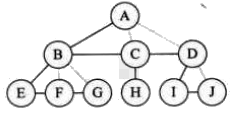
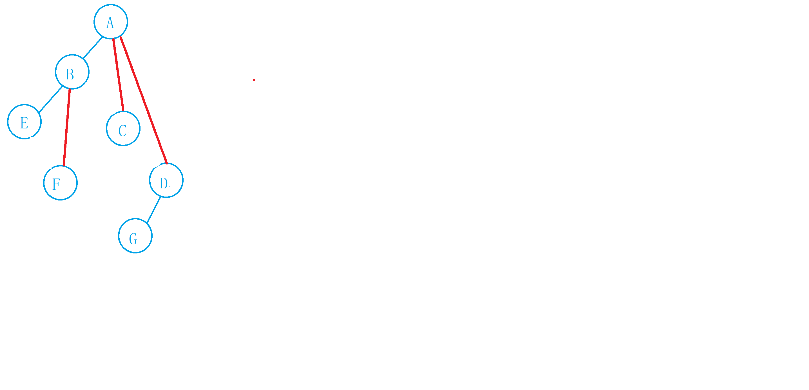

# 二叉树和树之间的转换

## 树转换成二叉树
步骤如下

* 加线: 在所有的兄弟结点之间加一条线

    

* 去线: 每个结点保留第一个孩子结点的连线，删除其他孩子结连线

    

* 调整: 以树的根结点为轴心，将整个树调节一下

    

## 二叉树转换成树
步骤如下

* 加线: 若某结点X存在左孩子结点，则将该左孩子的右孩子结点、右孩子的右孩子结点、右孩子的右孩子的右孩子结点.......与X结点用线连接起来
    

* 去线: 删除原二叉树中所有结点与其右孩子结点的连线

    

* 调整:
