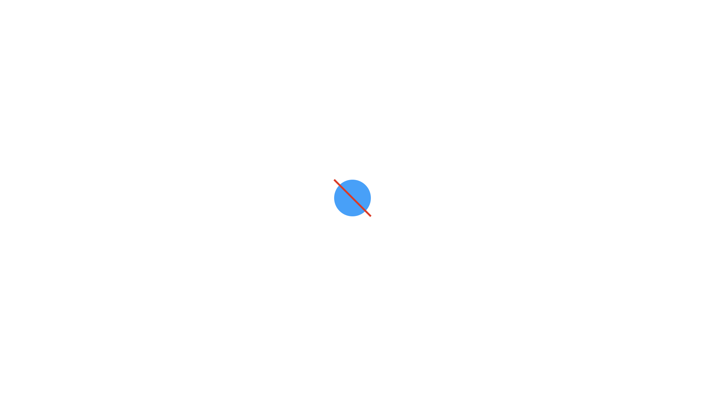
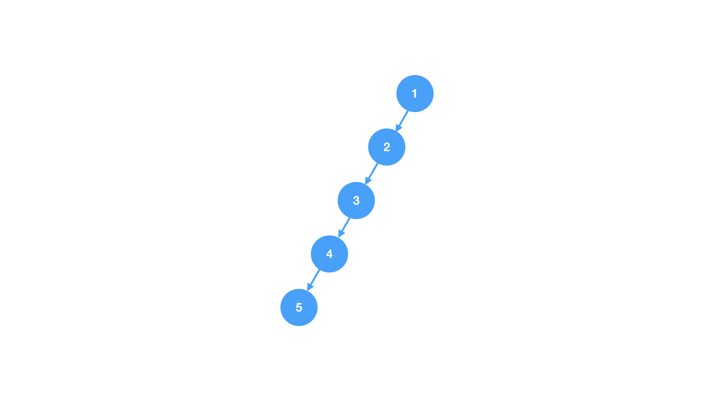
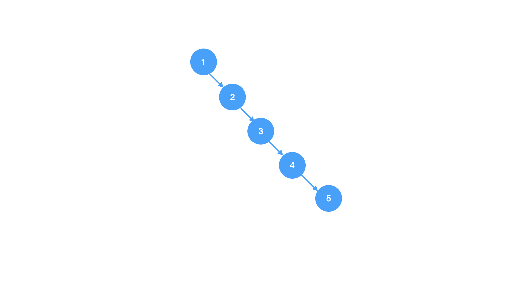
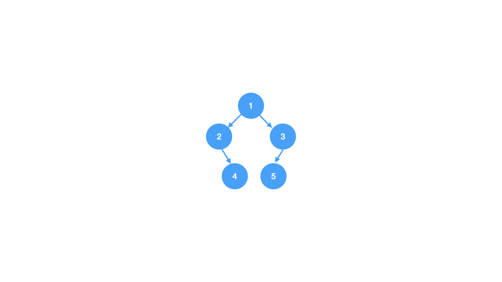
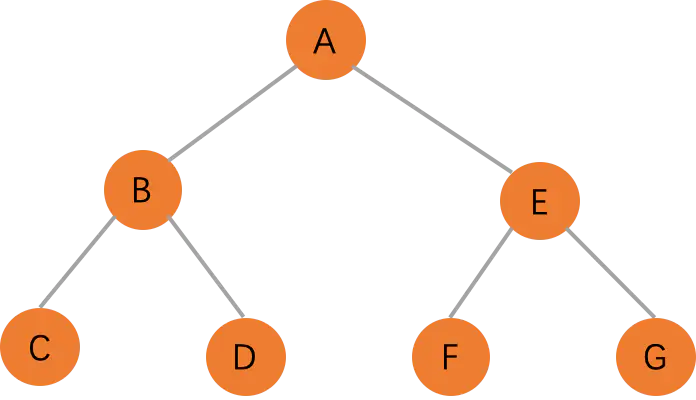

# 二叉树的概念

二叉树示意图

#### [什么是二叉树](https://zh.wikipedia.org/wiki/%E4%BA%8C%E5%8F%89%E6%A0%91)
在计算机科学中，二叉树（英语：Binary tree）是每个节点最多只有两个分支（即不存在分支度大于2的节点）的树结构。通常分支被称作“左子树”或“右子树”。二叉树的分支具有左右次序，不能随意颠倒。

注意: 二叉树是有序树，左右结点不能颠倒

#### 二叉树有什么作用
* 存储数据
* 优化压缩算法
* 优化搜索算法
* 实现数据库系统

#### 子树
子树是树中一个结点以及其下面所有的结点构成的树

#### 左子树和右子树
* 左子树: 是左孩子结点作为根节点的子树
* 右子树: 以右孩子结点作为根节点的子树

#### 空二叉树
没有任何结点的二叉树

### 只有跟结点的二叉树
只有跟一个结点

### 左斜树
只有左孩子的二叉树

### 右斜树
只有右孩子的二叉树

### 普通二叉树
既有左孩子也有右孩子的二叉树

### 满二叉树
满二叉树是最后一层是叶子结点，其余结点度是2的二叉树

性质: 
* 同样深度的二叉树中满二叉树结点数量最多
* 第`i`层的结点数量为: 2i - 1
* 深度为`k`的满二叉树，结点数量为: 2k -1，叶子数为2k -1
* 满二叉树中不存在度为 1 的节点，每一个分支点中都两棵深度相同的子树，且叶子节点都在最底层
* 具有 n 个节点的满二叉树的深度为 log2(n+1)

### 完全二叉树
完全二叉树是在一棵满二叉树基础上自左向右连续增加叶子结点得到的二叉树

性质:
* 叶子结点只能出现在最后两层
* 最后一层的叶子结点集中在左边连续的位置
* 除最后一层是一棵满二叉树

注意: 满二叉树一定是完全二叉树，但是完全二叉树不一定是满二叉树

### 问答

一颗二叉树共3个结点，共有多少种形态

答案: 5种

