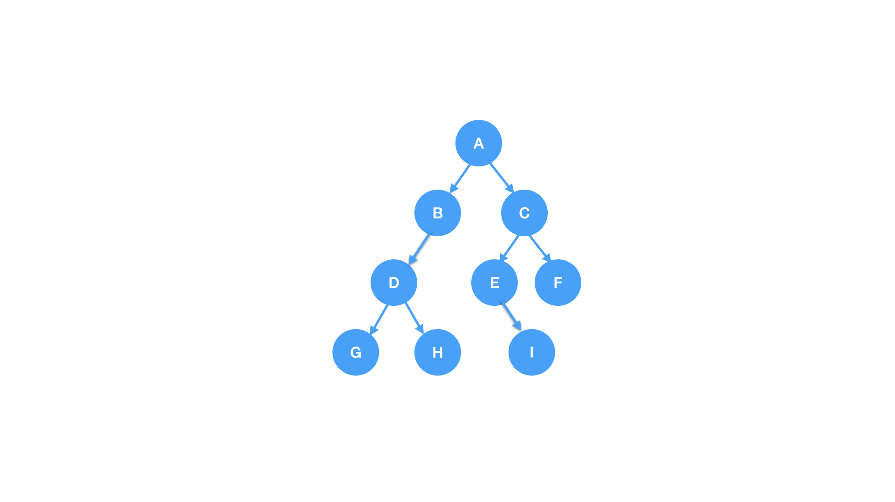
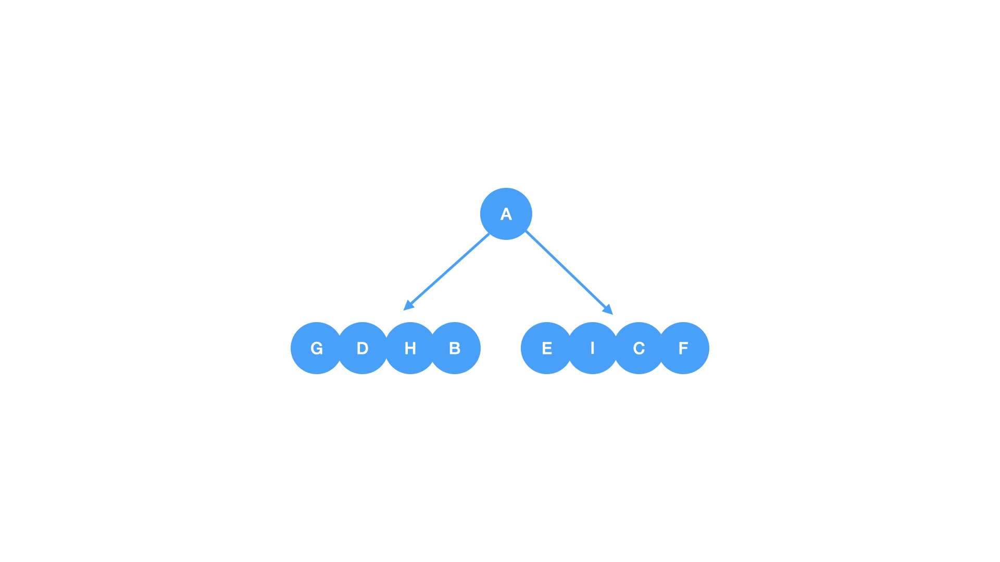
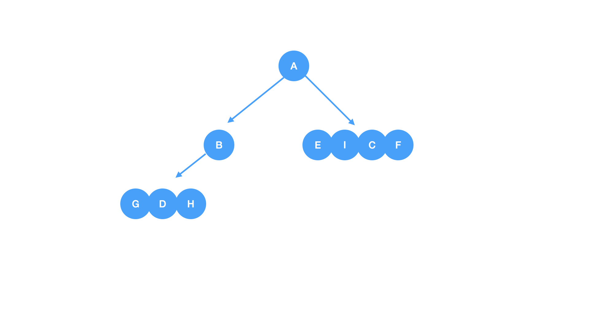
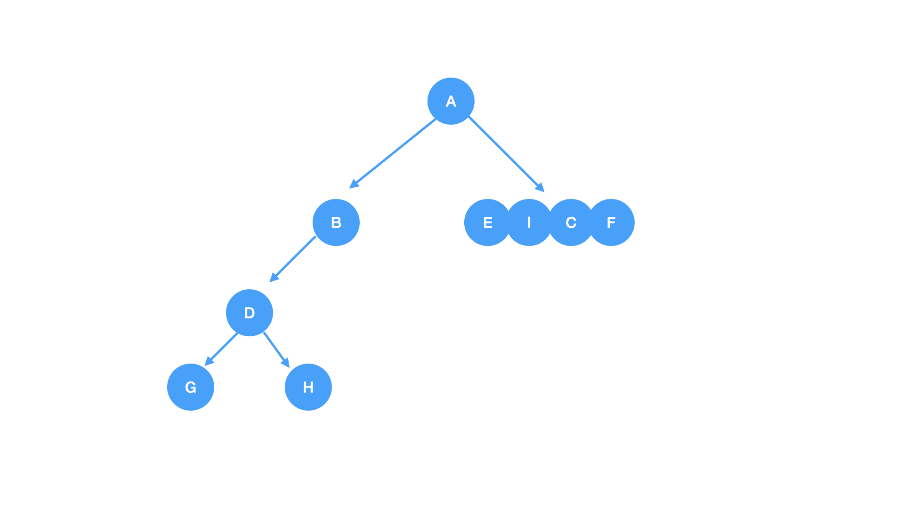
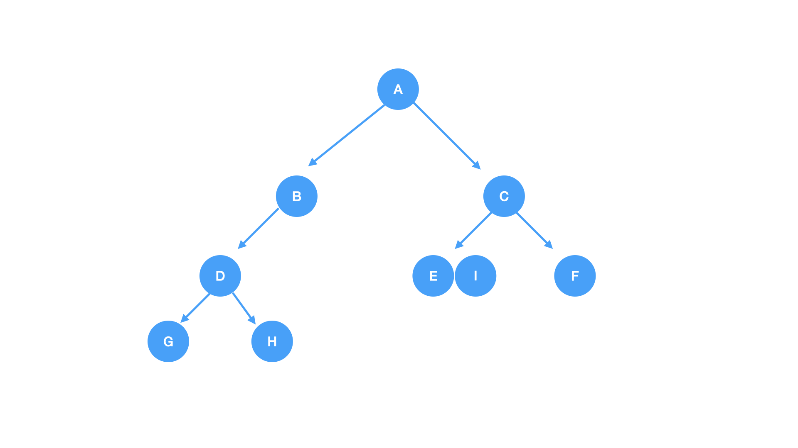
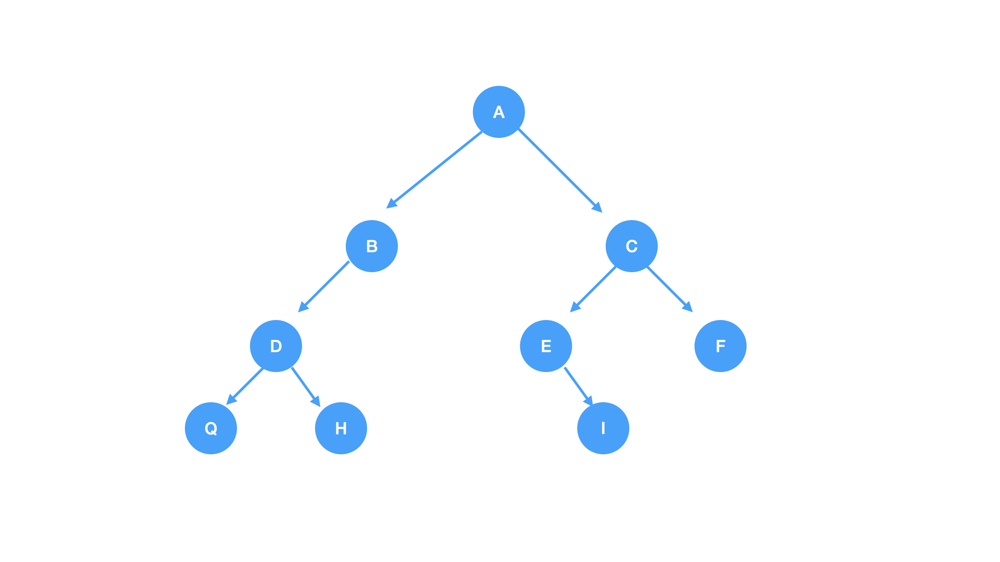

# 二叉树的遍历



* 先序遍历: A B D G H C E I F
* 中序遍历: G D H B A E I C F
* 后序遍历: G H D B I E F C A
* 层次遍历: A B C D E F G H I

### [什么是二叉树的遍历](https://zh.wikipedia.org/wiki/%E6%A0%91%E7%9A%84%E9%81%8D%E5%8E%86)
在计算机科学里，树的遍历（也称为树的搜索）是图的遍历的一种，指的是按照某种规则，不重复地访问某种树的所有节点的过程。具体的访问操作可能是检查节点的值、更新节点的值等。不同的遍历方式，其访问节点的顺序是不一样的。

### 先序遍历(Pre-Order Traversal)
1. 访问跟节点
2. 遍历左子树
3. 遍历右子树

特点: 根结点在整个序列的最前面

<details>
<summary>先序遍历代码</summary>

``` c
void preOrder(Node *root) {
    if (root != NULL) {
        printf("%d", root->data);
        preOrder(root->left);
        preOrder(root->right);
    }
}
```
</details>

### 中序遍历(In-Order Traversal)
1. 遍历左子树
2. 访问跟节点
3. 遍历右子树

特点: 左子树的序列位于根结点的左侧，右子树的序列位于根结点的右侧

<details>
<summary>中序遍历代码</summary>

``` c
void inOrder(Node *root) {
    if (root != NULL) {
        inOrder(root->left);
        printf("%d", root->data);
        inOrder(root->right);
    }
}
```
</details>

### 后序遍历(Post-Order Traversal)
1. 遍历左子树
2. 遍历右子树
3. 访问跟节点

特点: 根结点在整个后序遍历序列的最后面

<details>
<summary>后序遍历代码</summary>

``` c
void postOrder(Node *root) {
    if (root != NULL) {
        postOrder(root->left);
        postOrder(root->right);
        printf("%d", root->data);
    }
}
```
</details>

### 广度优先遍历
和深度优先遍历不同，广度优先遍历会先访问离根节点最近的节点。二叉树的广度优先遍历又称按层次遍历。算法借助队列实现。

### 二叉树的恢复
* 已知先序遍历和中序遍历恢复二叉树
* 已知后续遍历和中序遍历恢复二叉树

注意:如果未知中序遍历无法恢复二叉树，因为无法通过跟结点得出左子树和右子树

下面演示推导二叉树先序遍历的过程
>中序遍历: G D H B A E I C F<br/>
后序遍历: G H D B I E F C A

1. 从后序可以推导出根是 `A`，再观察 `A` 在中序中的位置，`A` 左边的是 `A` 的左子树(`G D H B`)，`A` 右边的是 `A` 的右子树(`E I C F`)



>中序遍历: G D H B A E I C F<br/>
后序遍历: G H D B I E F C A
2. 接下来分解左子树(`G D H B`)，观察左子树结点中那个结点最后在后序里面出现，那个结点最后出现则说明那个结点是左子树的跟，可以发现结点 `B` 最后出现，则说明结点 `B` 是左子树的跟，可以从中序中观察出 `G D H` 是 `B` 的左子树




>中序遍历: G D H B A E I C F<br/>
后序遍历: G H D B I E F C A
3. 继续分解左子树(`G D H`)，观察到结点 `D` 在后续遍历中最后出现，则说明结点 `D` 是跟，则可以断定出 `D` 的左孩子是 `G`，右孩子是 `H`




>中序遍历: G D H B A E I C F<br/>
后序遍历: G H D B I E F C A
4. 接下来分解 `A` 的右子树(`E I C F`)，可以观察到右子树中结点 `C` 在后续中最后出现，则说明 `C` 是跟，`E I` 是 `C` 的左子树，`F` 是 `C` 的右子树




>中序遍历: G D H B A E I C F<br/>
后序遍历: G H D B I E F C A
5. 接下来再分解子树 `E I`，观察到结点 `E` 在后续里面最后出现，所以结点 `E` 是跟，`I` 是 `E` 的右孩子




### 参考代码
* [C语言实现](https://github.com/examplehub/C/blob/master/datastructures/binarytree/example_binary_tree.c)
* [Java语言实现](https://github.com/examplehub/Java/blob/master/src/main/java/com/examplehub/datastructures/binarytree/BasicBinaryTree.java)


