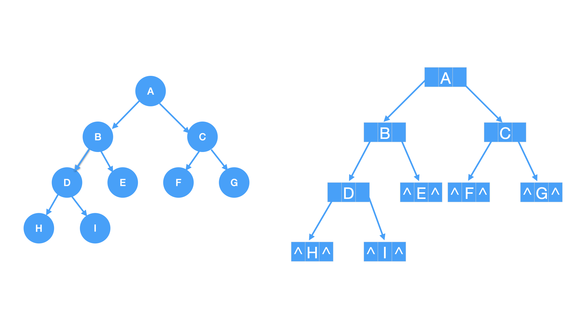

# 二叉树的链式存储



### 二叉树的结点类型
每个结点包含三部分
* 数据域(data): 存储结点本身的值
* 左指针(left): 存储左孩子的地址
* 右指针(right): 存储右孩子的地址

``` c
typedef struct Node {
    ElemType data;
    struct Node *left;
    struct Node *right;
} Node;
```