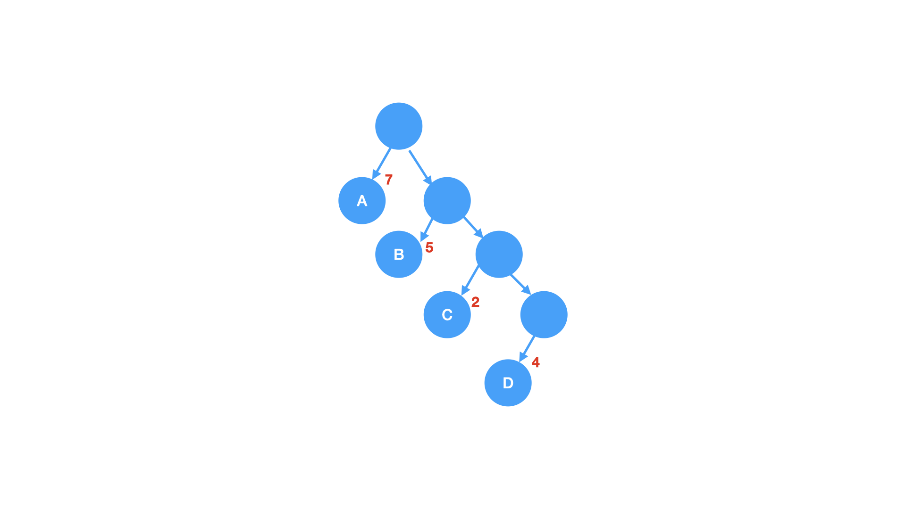
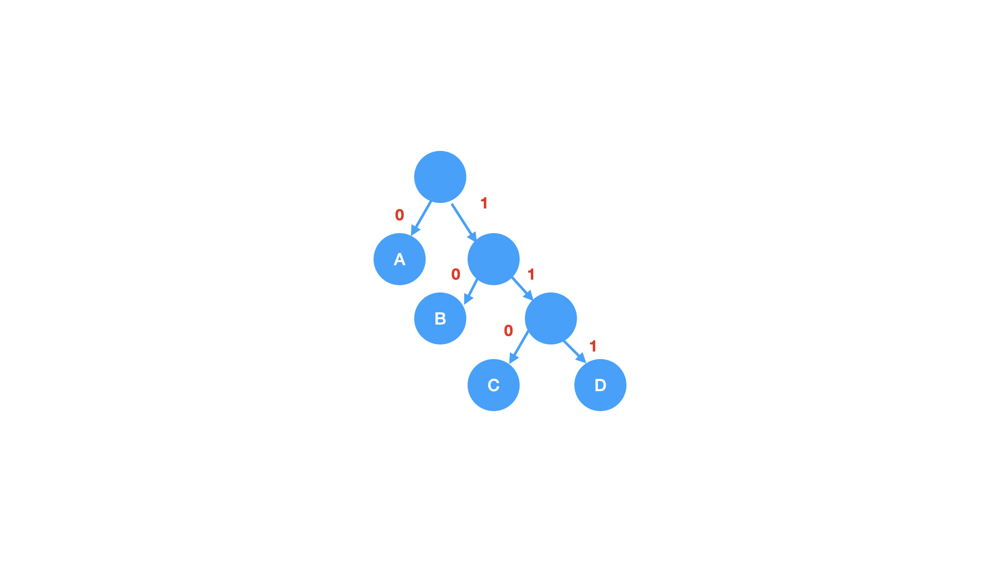

# 哈夫曼树

### 相关概念
* 路径: 一个结点到另一个结点之间的分支序列，如根节点到结点C的路线就是路径
* 路径长度: 一个结点到另一个结点所经过分支的数目，如根节点到结点C的路径长度为`3`
* 树的路径长度: 树的路径长度是指从树根到每个结点的路径长度之和，上图的为`16`
* 结点的权: 结点的权是指结点中存储的有特定意义的数值，如A的权为`7`，D的为`4`
* 结点的带权路径长度: 从树根到某结点的路径长度和该结点的权的乘积，如节点C的带权路径长度为 `3*2=6`
* 树的带权路径长度(WPL): 树中所有叶子结点的带权路径长度之和

    `WPL = 7*1 + 2*5 + 3*2 + 4 * 4 = 39`

### 什么是哈夫曼树
> 当用 n 个结点（都做叶子结点且都有各自的权值）试图构建一棵树时，如果构建的这棵树的带权路径长度最小，称这棵树为“最优二叉树”，有时也叫“赫夫曼树”或者“哈夫曼树”。

在构建哈弗曼树时，要使树的带权路径长度最小，只需要遵循一个原则，那就是：权重越大的结点离树根越近。在图 1 中，因为结点 a 的权值最大，所以理应直接作为根结点的孩子结点。

### 构造哈夫曼树
* 在 n 个权值中选出两个最小的权值，对应的两个结点组成一个新的二叉树，且新二叉树的根结点的权值为左右孩子权值的和
* 在原有的 n 个权值中删除那两个最小的权值，同时将新的权值加入到 n–2 个权值的行列中，以此类推
* 重复 1 和 2 ，直到所以的结点构建成了一棵二叉树为止，这棵树就是哈夫曼树

> 给定了四个结点a，b，c，d，权值分别为7，5，2，4；第一步如（B）所示，找出现有权值中最小的两个，2 和 4 ，相应的结点 c 和 d 构建一个新的二叉树，树根的权值为 2 + 4 = 6，同时将原有权值中的 2 和 4 删掉，将新的权值 6 加入；进入（C），重复之前的步骤。直到（D）中，所有的结点构建成了一个全新的二叉树，这就是哈夫曼树。

### 哈夫曼编码
哈夫曼编码就是在哈夫曼树的基础上构建的，这种编码方式最大的优点就是用最少的字符包含最多的信息内容。

字符 A 用到的次数最多，其次是字符 B 。字符 A 在哈夫曼编码是 0 ，字符 B 编码为 10 ，字符 C 的编码为 110 ，字符 D 的编码为 111
