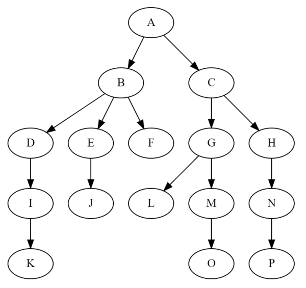
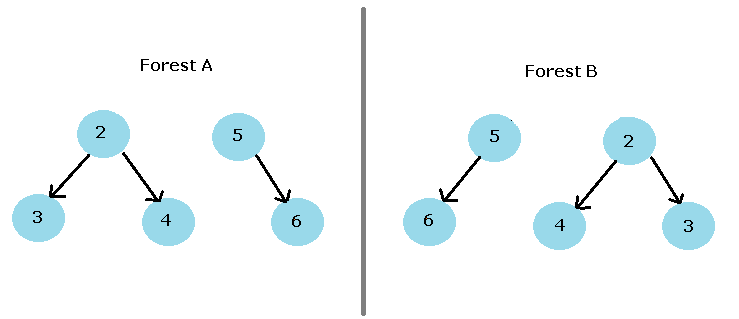

# 树的基本概念

### 什么是树
在计算机科学中，树（英语：tree）是一种抽象数据类型（ADT），用来模拟具有树状结构性质的数据集合。它是由n（n>0）个有限节点组成一个具有层次关系的集合。把它叫做“树”是因为它看起来像一棵倒挂的树，也就是说它是根朝上，而叶朝下的。它具有以下的特点：
* 一对多的数据结构
* 每个节点都只有有限个子节点或无子节点
* 没有父节点的节点称为根节点
* 每一个非根节点有且只有一个父节点
* 除了根节点外，每个子节点可以分为多个不相交的子树
* 树里面没有环路(cycle)
* 树的定义具有递归性

### 树的相关术语
* 结点: 树中的数据元素称之为结点
* 根结点: 没有父节点的结点(最顶层的结点)
* 结点的度:一个节点含有的子树的个数称为该节点的度
* 树的度:一棵树中，最大的节点度称为树的度
* 叶节点或终端节点:度为 `0` 的节点
* 非终端节点或分支节点:度不为零的节点
* 父亲节点或父节点:若一个节点含有子节点，则这个节点称为其子节点的父节点
* 孩子节点或子节点:当前结点的直接下级结点
* 兄弟节点:具有相同父节点的节点互称为兄弟节点
* 节点的层次:从根开始定义起，根为第1层，根的子节点为第2层，以此类推(或者从根节点到某节点所经路径上的层次数)
* 深度:对于任意节点n,n的深度为从根到n的唯一路径长，根的深度为0
* 高度:对于任意节点n,n的高度为从n到一片树叶的最长路径长，所有树叶的高度为0 
* 堂兄弟节点:父节点在同一层的节点互为堂兄弟
* 节点的祖先:从根到该节点所经分支上的所有节点
* 子孙:以某节点为根的子树中任一节点都称为该节点的子孙
* 空树:结点个数为0
* 子树:树中一个结点以及其下面所有的结点构成的树 (子集)
* 森林:由m（m>=0）棵互不相交的树的集合称为森林

### 树的作用
* 表示元素之间具有层次关系的数据
* 实现内存的持久化管理
* 分治及递归算法使用树表达、辅助理解
* 提高搜索效率
* 文件压缩

### 树的分类
* 无序树：树中任意节点的子节点之间没有顺序关系，这种树称为无序树，也称为自由树。
* 有序树：树中任意节点的子节点之间有顺序关系，这种树称为有序树；

### 森林的定义
森林A和森林B示意图

* 森林是指0或多棵互不相交树的集合
* 森林也可以看成是好多棵互不相连的非空的树，只有一棵树也可以算是森林。不过森林不一定是一棵树。
* 森林也可以是有根的，这时候森林中的每一棵树都有一个根。
* 一棵树去掉若干条边也会成为森林，这时候可以看成一棵树分成了好多棵树。森林中的两棵树之间加一条边，也可以把这两棵树合在一起，最终合成一棵树。

### 树的相关公式
* 结点数量 = 树杈数 + 1
* 结点数量n = n0 + n1 + n2 + n3 + ...ni

面试题1: 设树T的度为4,其中度为1,2,3和4的结点个数分别为4,2,1,1,则T中的叶子数为 ( )

一棵含有n个结点的树，有n-1个分支，即 n = 1*4 + 2*2 + 3*1 + 4*1 + 1 = 16;
又由于 n = n0 + n1 + n2 + n3 + n4 = n0 + 8;
n0 + 8 = 16，所有叶子结点个数为 8

面试题2: 设树T的度为4,其中度为1,2,3和4的结点个数分别为4,2,2,1,则T中的叶子数为 ( )

答: 10

