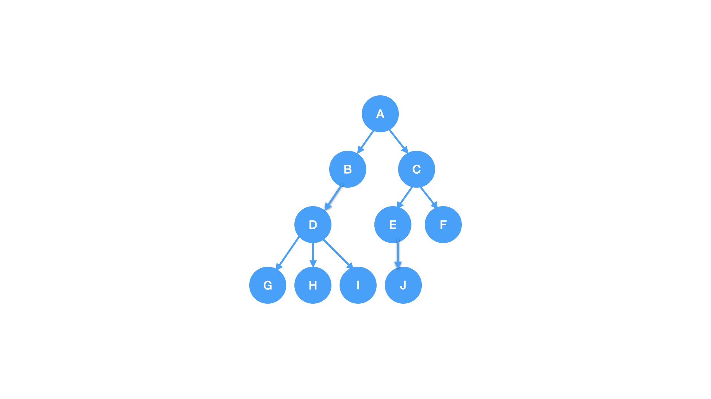
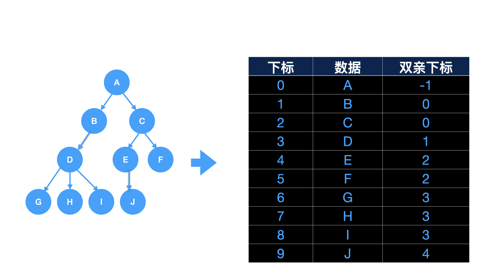

# 树的存储结构

### 双亲表示法
* 以一组连续存储空间存储树中的结点
* 每个数据元素包含数据域及双亲在数组中的下标

下图表示一棵树的双亲表示法示意图，其中结点 `A` 存放在数组下标0的位置，因为结点 `A` 无双亲，则其双亲的下标为 `-1`

* 优点:`parent`指向其双亲所在数组中的下标，所以查找双亲结点的时间复杂度为 `O(1)`，搜索整棵树的根节点也很快速。
* 缺点: 由上向下找就十分慢，若要找结点的孩子或者兄弟，要遍历整个树

[代码实现](https://github.com/examplehub/C/blob/master/datastructures/tree/parent_tree.c)

### 双亲表示法改进
* 增加结点最左边的孩子域易于得到结点的孩子
* 如果没有孩子的结点，这左孩子域就置为-1

结点定义

示意图

### 孩子表示法
* 每个结点的孩子以单链表作为存储结构
* 每个单链表的头指针组成线性表，采用顺序存储结构
* n个结点有n个孩子链表，如果是叶子结点则此单链表为空

### 孩子兄弟表示法
* 采用链式存储，描述结点的孩子、兄弟关系
* 设置两个指针，分别指向该结点的第一个孩子和此结点的右兄弟

结点定义

示意图

